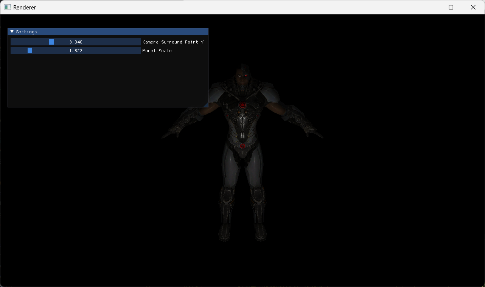
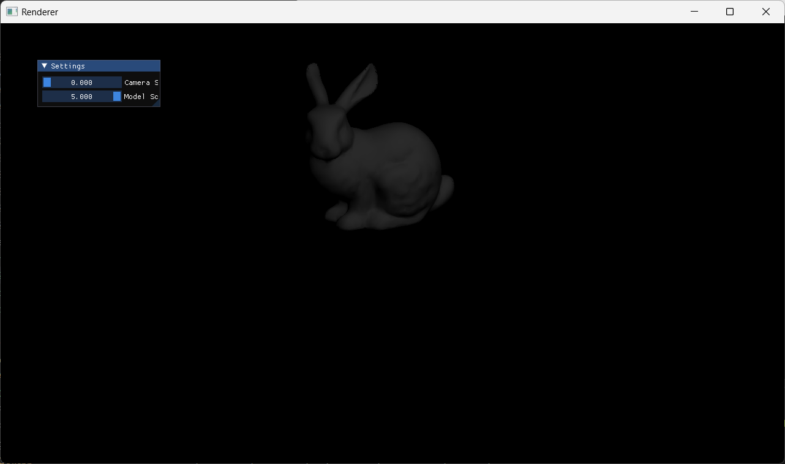
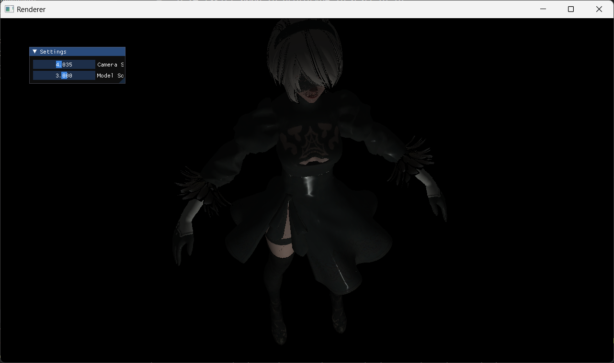
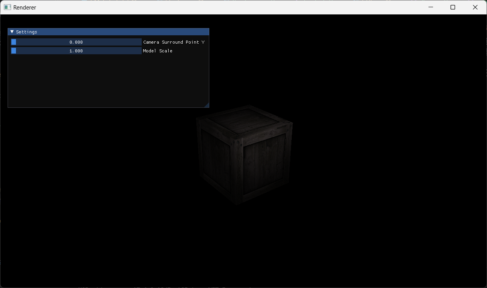

# Simple Soft Renderer
This is a simple soft rasterization renderer written in C++. It implements simple rendering pipeline.  

## Dependency
- [assimp](https://github.com/assimp/assimp)
- [stb](https://github.com/nothings/stb)
- [Eigen](https://eigen.tuxfamily.org/index.php?title=Main_Page)
- [Dear ImGui](https://github.com/ocornut/imgui)
- [GLFW](https://github.com/glfw/glfw)

It uses [assimp](https://github.com/assimp/assimp) to load 3d models and use [stb](https://github.com/nothings/stb) to load texture(picture), using [Eigen](https://eigen.tuxfamily.org/index.php?title=Main_Page) as mathematics library.  
GUI drawing uses [Dear ImGui](https://github.com/ocornut/imgui) with [GLFW](https://github.com/glfw/glfw) and opengl(opengl is only used to display the results and does not involve the rendering process)  


## Environment
Only tested with Visual Studio 2022 community on Windows11.  

## Implemented Contents
- Basic pipeline (vertex shader -> rasterization -> fragment shader)
- Perspective projection correction
- Diffuse/Specular/Normal texture mapping
- Surround camera
- Early-Z

## Case
  
  
  
  

## Usege
compile  
```
mkdir build
cd build
cmake ..
cmake --build . --config Release
```

run
```
./SimpleSoftRenderer  [model_path]
```

## Shortcomings
- Not fully tested
- "Real-time" rendering is laggy(Implementation may be too complicated)(Compiling in Release mode can solve this problem to a certain extent)
- Only support .obj model with .mtl file and only read ka/kd/ks/Ns/Map_Kd/Map_Bump/Map_Ks item in .mtl file

## Reference
- [LearnOpenGL](https://github.com/JoeyDeVries/LearnOpenGL)
- [Games101 course](https://www.bilibili.com/video/BV1X7411F744/?spm_id_from=333.999.0.0&vd_source=5ce17db761bbe7d09338840ac32c2ed9)