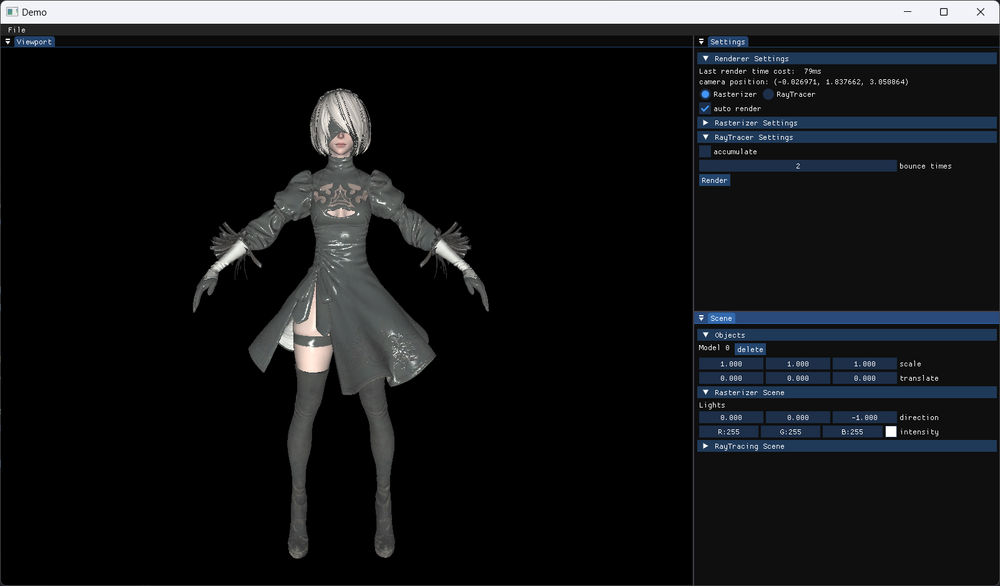
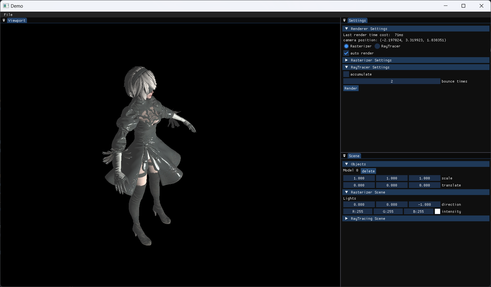
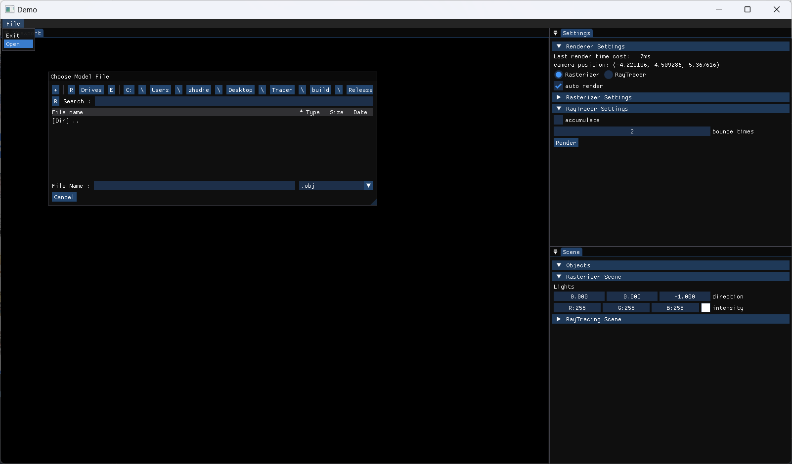

# Simple Soft Renderer

A soft renderer written in C++. It implements a basic rasterizer and a ray tracer.

## Dependency

- [assimp](https://github.com/assimp/assimp)
- [stb_image](https://github.com/nothings/stb)
- [glm](https://github.com/g-truc/glm)
- [ImGui](https://github.com/ocornut/imgui)
- [ImGuiFileDialog](https://github.com/aiekick/ImGuiFileDialog)
- [GLFW](https://github.com/glfw/glfw)
- [vulkan](https://www.vulkan.org/)
- [Walnut](https://github.com/StudioCherno/Walnut)

It uses [assimp](https://github.com/assimp/assimp) to load 3d models and use [stb](https://github.com/nothings/stb) to load texture(picture), using [glm](https://github.com/g-truc/glm) as mathematics library.  
[ImGui](https://github.com/ocornut/imgui), [ImGuiFileDialog](https://github.com/aiekick/ImGuiFileDialog), [Walnut](https://github.com/StudioCherno/Walnut), [GLFW](https://github.com/glfw/glfw) and [vulkan](https://www.vulkan.org/) are used for GUI drawing.

## Environment

Only tested with Visual Studio 2022 community on Windows11.  
Cmake version 3.17  

## Content
- Basic rasterization rendering pipeline  
- Ray tracing rendering of simple objects
- Scene multi-object control and rendering

## Case
Rasterizer



RayTracer

obj load


## Usege

You need to install vulkan and its accompanying third-party library (glm) first.  
assimp .dll is compiled by vs2022 under debug mode.

```
# download
git clone git@github.com:zhedie/SoftRenderer.git
cd SoftRenderer
# compile
mkdir build
cd build
cmake ..
cmake --build . --config Release
# run
cd Release
./SimpleSoftRenderer
```

## Reference

- [LearnOpenGL](https://github.com/JoeyDeVries/LearnOpenGL)
- [Games101 course](https://www.bilibili.com/video/BV1X7411F744/?spm_id_from=333.999.0.0&vd_source=5ce17db761bbe7d09338840ac32c2ed9)
- [RayTracing](https://www.youtube.com/watch?v=gfW1Fhd9u9Q&list=PLlrATfBNZ98edc5GshdBtREv5asFW3yXl&index=1) by the Cherno